# Science Flash Cards
(Developer: Mohamed Abdillahi)

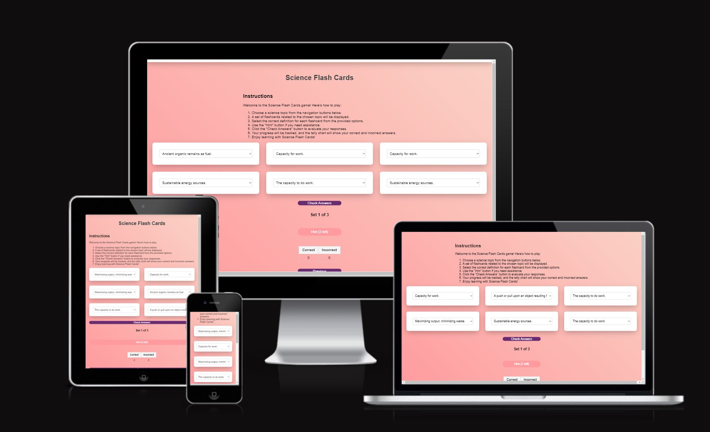

[Live webpage](https://mabdillahi88.github.io/CI_PP2_SCIENCE_FLASHCARDS/index.html)

## Table of Content

1. [Project Goals](#project-goals)
    1. [User Goals](#user-goals)
    2. [Site Owner Goals](#site-owner-goals)
2. [User Experience](#user-experience)
    1. [Target Audience](#target-audience)
    2. [User Requrements and Expectations](#user-requrements-and-expectations)
    3. [User Stories](#user-stories)
3. [Design](#design)
    1. [Design Choices](#design-choices)
    2. [Colour](#colours)
    3. [Fonts](#fonts)
    4. [Structure](#structure)
    5. [Wireframes](#wireframes)
4. [Technologies Used](#technologies-used)
    1. [Languages](#languages)
    2. [Frameworks & Tools](#frameworks-&-tools)
5. [Features](#features)
6. [Testing](#validation)
    1. [HTML Validation](#HTML-validation)
    2. [CSS Validation](#CSS-validation)
    3. [Accessibility](#accessibility)
    4. [Performance](#performance)
    5. [JavaScript Validation](#javascript-validation)
    6. [Device testing](#performing-tests-on-various-devices)
    7. [Browser compatibility](#browser-compatability)
    8. [Testing user stories](#testing-user-stories)
9. [Bugs](#Bugs)
10. [Deployment](#deployment)
11. [Credits](#credits)
12. [Acknowledgements](#acknowledgements)

## Project Goals

Science Flash Cards aims to create an interactive and user-friendly  game that tests and expands players' scientific knowledge.

### User Goals

 - Enjoy playing a fun and engaging game that tests and expands their scientific knowledge.
 - Experience a game with easy-to-understand rules that maintains their interest.
 - Challenge themselves to learn and recall new scientific terms and definitions.

### Site owner goals

 - Develop a captivating and interactive game that provides an enjoyable experience for users.
 - Ensure the website's aesthetics are visually appealing to enhance user engagement.
 - Design the website with a user-friendly interface that allows for easy navigation.
 - Create a fully responsive and accessible website to accommodate users across different devices and a
   ccessibility needs.

## User Experience

### Target audiene

 - Science enthusiasts and learners of all ages.
 - Students studying science subjects.
 - Individuals looking to improve their scientific knowledge and vocabulary.
 - Gamers who enjoy educational and interactive experiences.

### User Expectations

 - Engaging gameplay that expands scientific knowledge.
 - Clear and concise rules with intuitive navigation.
 - Interactive and visually appealing design.
 - Responsive and accessible website across devices.
 - Informative content for learning scientific terms.
 - Availability of hints and progress tracking.
 - Easy feedback and contact options for providing input to the creator.

 ## User Stories

1. As a first-time user, I want to easily explore the Science Flash Card game and navigate between 
   different science topics and the contact form.
2. As a first-time user, I expect the game's rules to be straightforward and easy to understand, so I can 
   quickly grasp how to play and learn from the flashcards.
3. As a first-time user, I want the game to be accessible on various devices, such as computers, tablets 
   or phones, allowing me to conveniently learn anywhere.
4. As a first-time user, I value having clear and concise information on each flashcard to help me learn 
   scientific terms accurately and efficiently and under timed condition using a timer.
5. As a first-time user, I would appreciate having hints available when I need assistance with the 
   flashcards, making it easier for me to learn and understand the content.
6. As a first-time user, I find it beneficial to be able to track my progress and view my performance  
   with the flashcards, giving me visibility into how well I am doing and motivating my learning experience.
7. As a first-time user, I want an easy way to provide feedback to the game's creator, sharing my  
   thoughts or reporting any issues.
8. As a first-time user, I expect the Science Flash Card game to run smoothly and have all the features 
   working properly for a seamless learning experience.
9. As a first-time user, I want confirmation that my message was sent.

### Site Owner

10. As a site Owner , I want the Science Flash Card game to be easy to understand and play.

11. As a site Owner, I expect the game to work well on any device I use.

12. As a site Owner, if I enter an invalid URL, I want to see a helpful 404 error page instead of being confused.

13. As a site Owner, I want to have a straightforward way to contact the site owner and share my comments or feedback.

## Design

The website aims to visually captivate users and showcase the Science Flash Card game, providing an engaging and immersive online gaming experience.

### Colour Scheme

For the colour theme,Buttery Salmon brings warmth and comfort, creating a soothing and inviting atmosphere, while Coral Candy exudes playfulness and vibrancy, uplifting moods and creating a joyful ambiance. These colors offer distinct benefits, whether you seek tranquility or a visually appealing and energetic environment.

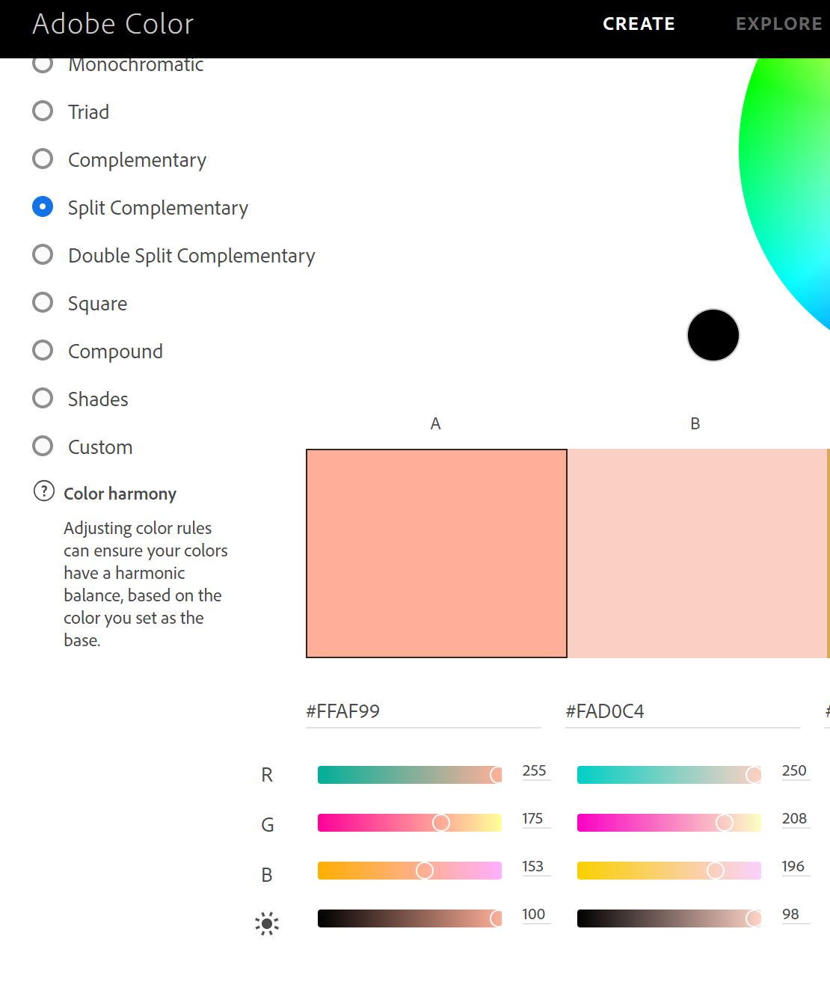

### Fonts 

The versatile choice of Arial, sans-serif font brings a host of benefits to your website's design. Not only does it ensure a cohesive and visually appealing look, but it also creates a delightful and harmonious experience for users. With Arial's clean and modern appearance, your website will exude an attractive and polished vibe that captures attention and enhances its overall aesthetic appeal.

### Structure

The website's layout is simple and intuitive, with consistent aesthetics throughout. It offers a seamless and visually appealing user experience, making it easy to navigate and enjoy the game.

### The game's screens are as follows:

#### Science flash cards

 - navigation bar with links to different webpages, such as "Home" and "Contact Us," so that I can easily 
   navigate between different sections of the website.
 - clear instructions that provide me with clear guidance on how to play and interact 
   with the flashcards, so that I can understand the rules and instructions of the game.
 - sets of questions presented as flashcards, where each flashcard displays scientific terms and their 
   corresponding definitions, so that I can learn and reinforce my knowledge in science.
 - "Check Answers" button that allows me to verify my answers for each flashcard, so that I can evaluate 
   my understanding and accuracy.
 - "Hint" feature that provides additional assistance or clues for each flashcard, so that I can get help 
   when I am unsure of the correct answer.
 - navigation buttons, such as "Previous" and "Next," that enable me to move between different sets of 
   questions or flashcards, so that I can easily navigate and explore the content.
 - tally table that tracks and displays my performance, showing the number of correct and incorrect 
   answers, so that I can monitor my progress and identify areas for improvement.

### Wireframes

# science flash card
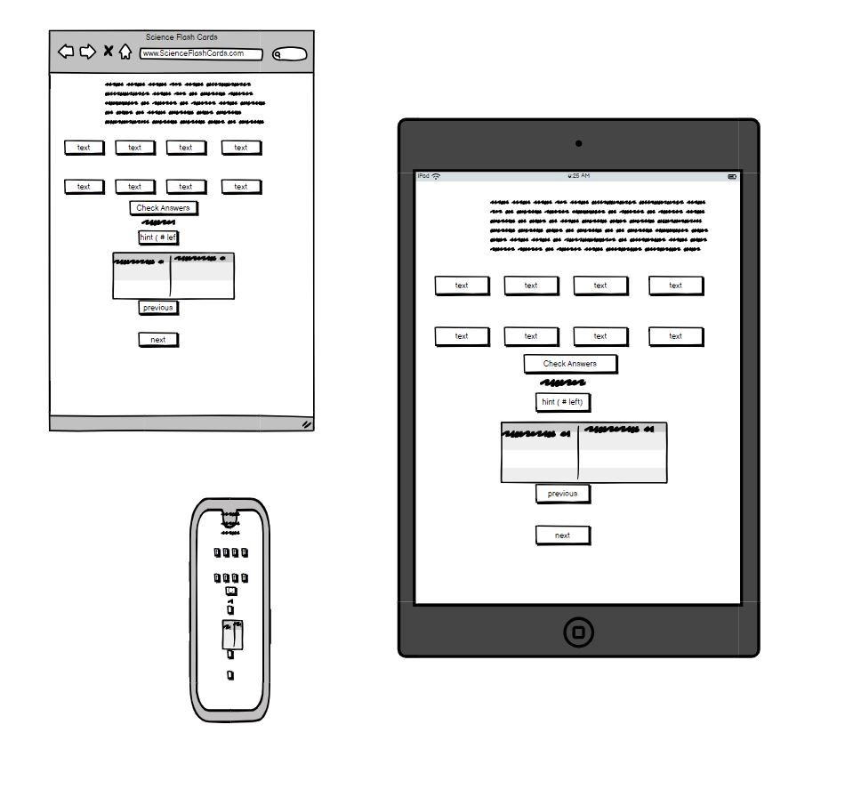

#### Contact form

- A contact page with a contact form that enables users to email the developer with questions or comments 

# Contact form
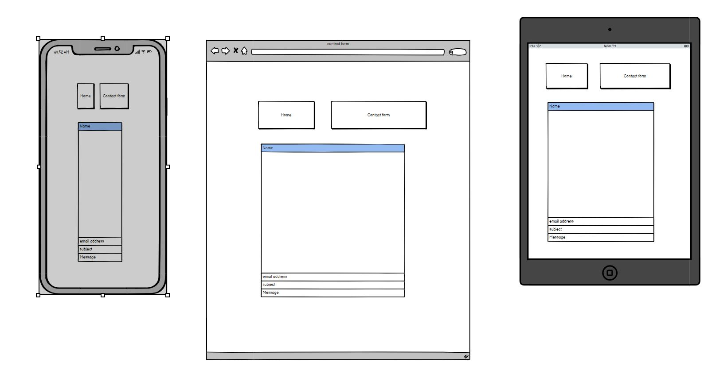

#### 404 error page

- A separate 404 error page

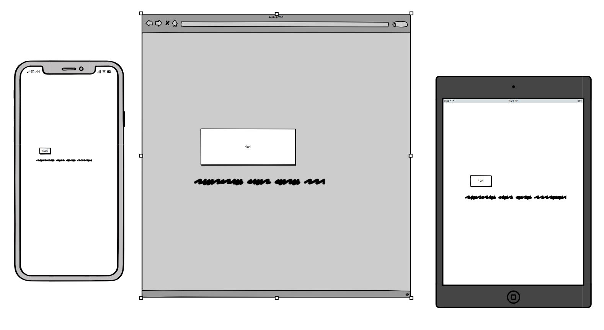

## Technologies Used

### Languages

- HTML
- CSS
- JavaScript

### Frameworks & Tools

- Git
- GitHub
- Gitpod
- Balsamiq
- Google Fonts
- Adobe Color
- Font Awsome
- Favicon
- Bootstrap
- Email js
- Chrome development tools

### Tools for validation

- [WC3 Validator](https://validator.w3.org/)
- [Jigsaw W3 Validator](https://jigsaw.w3.org/css-validator/)
- [JShint](https://jshint.com/)
- [Wave Validator](https://wave.webaim.org/)
- [Lighthouse](https://developers.google.com/web/tools/lighthouse/) 
- [Am I Responsive](http://ami.responsivedesign.is/)

## Features

### Testing

#### HTML Validation

The W3C Markup Validation Service was used to validate the HTML of the website. All pages pass with no errors.

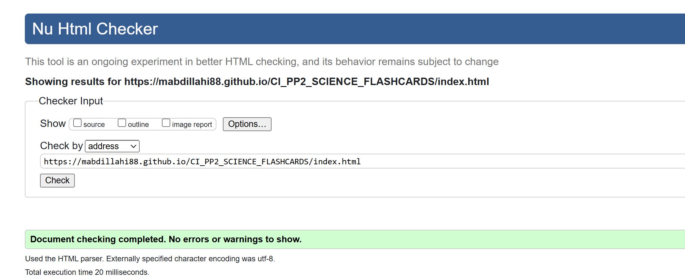

contact.html [results](https://validator.w3.org/nu/?showsource=yes&doc=https%3A%2F%2Fmabdillahi88.github.io%2FCI_PP2_SCIENCE_FLASHCARDS%2Fcontact_form.html)

#### CSS Validation
The W3C Jigsaw CSS Validation Service was used to validate the CSS of the website.

style.css [results](https://jigsaw.w3.org/css-validator/validator?uri=https%3A%2F%2Fmabdillahi88.github.io%2FCI_PP2_SCIENCE_FLASHCARDS%2Findex.html&profile=css3svg&usermedium=all&warning=1&vextwarning=&lang=en)

contact_form [results](https://jigsaw.w3.org/css-validator/validator?uri=https%3A%2F%2Fmabdillahi88.github.io%2FCI_PP2_SCIENCE_FLASHCARDS%2Fcontact_form.html&profile=css3svg&usermedium=all&warning=1&vextwarning=&lang=en)

#### Accessibility
The WAVE WebAIM web accessibility evaluation tool was used to ensure the website met high accessibility standards. All pages pass with 0 errors.

index.html [results](https://wave.webaim.org/report#/https://mabdillahi88.github.io/CI_PP2_SCIENCE_FLASHCARDS/index.html) 

contact.html [results](https://wave.webaim.org/report#/https://mabdillahi88.github.io/CI_PP2_SCIENCE_FLASHCARDS/contact_form.html)

404.html [results](https://wave.webaim.org/report#/https://mabdillahi88.github.io/CI_PP2_SCIENCE_FLASHCARDS/index.html1)

#### Performance 

Despite my efforts, I encountered persistent issues while testing the website's performance using Google Lighthouse in Chrome DevTools. I attempted various troubleshooting steps such as shutting down browsers and applications and trying different internet connections, but unfortunately, the problem persisted. I have documented the error messages that consistently appeared, and the tool froze every time.

#### Index page

#### Contact form page

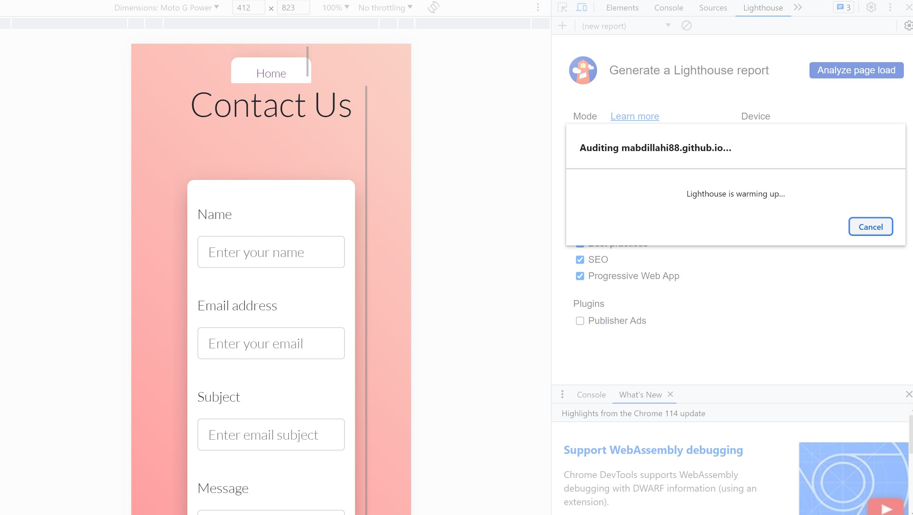

#### 404 error page

### JavaScript Validation

The Javascript files were checked using JSHint JS Validation Service. No major problems were discovered.

#### Index page

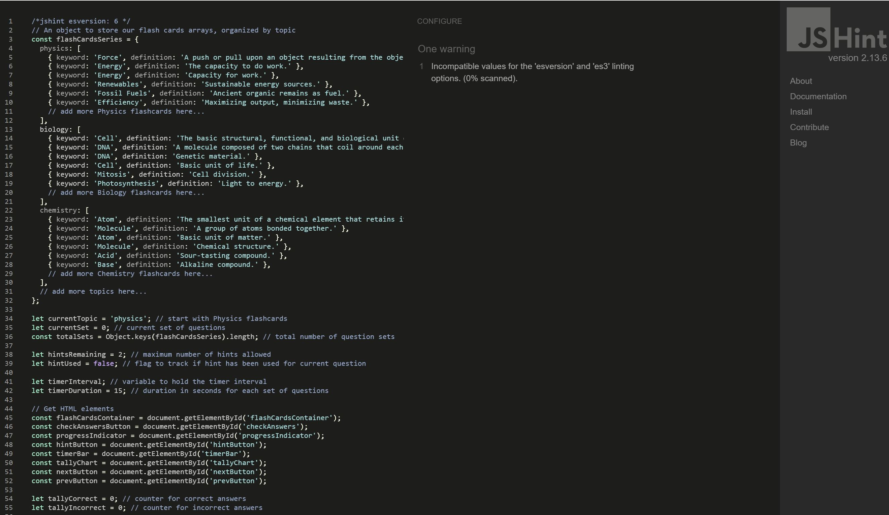

#### Contact form page

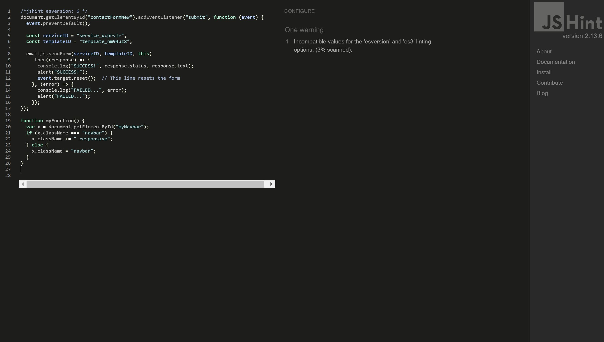

# Testing

### Performing tests on various devices 
The website was tested on the following devices:
- Surface Pro 7 
- iPhone 5/SE
- iPad air

Google Chrome Developer Tools Device Toggling was utilized to evaluate all webpages across all feasible device combinations

### Browser compatibility

- The following browsers have been put to the test:
  - Googe Chrome 
  - Firefox Browser 

 
### Testing 

  #### Testing user stories

1. As a first-time user, I want to easily explore the Science Flash Card game and navigate between 
   different science topics and the contact form.

| **Feature**       | **Action**        | **Expected Result**                  | **Actual Result** |
| ----------------- | ----------------- | ------------------------------------ | ----------------- |
|  Explore Game and contact form |  Navigate and switch topics and contact form | Easy exploration | Works as expected |

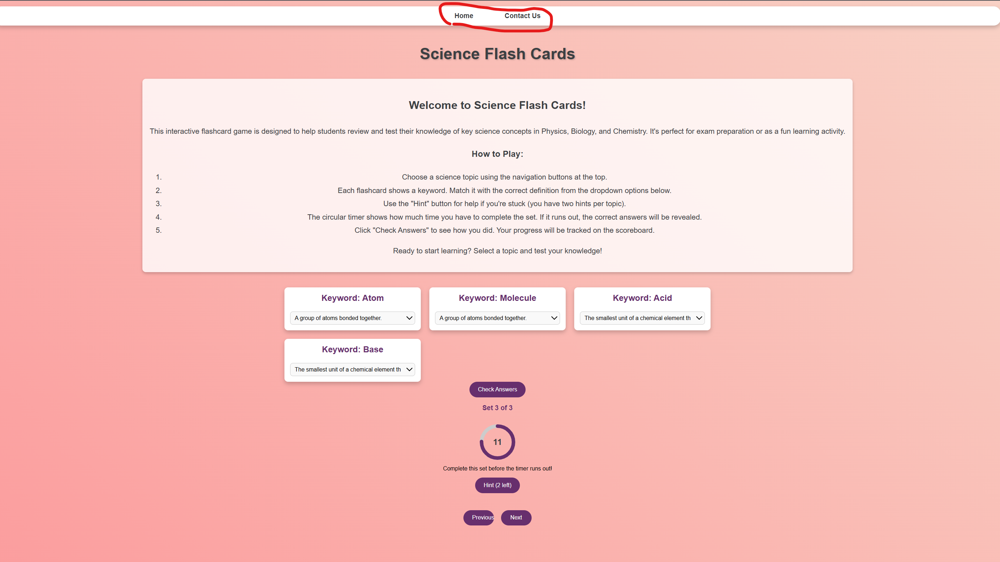

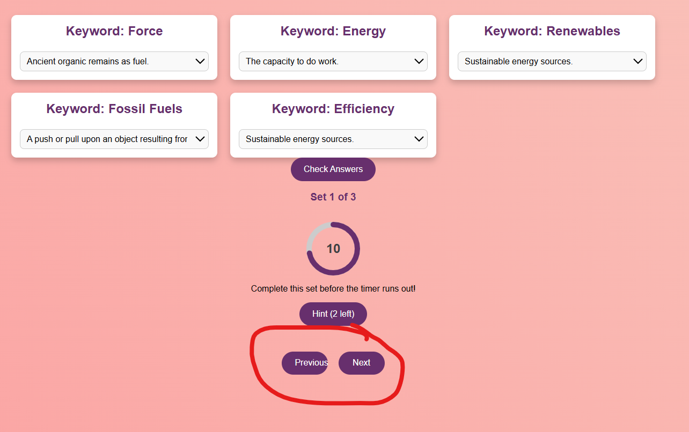

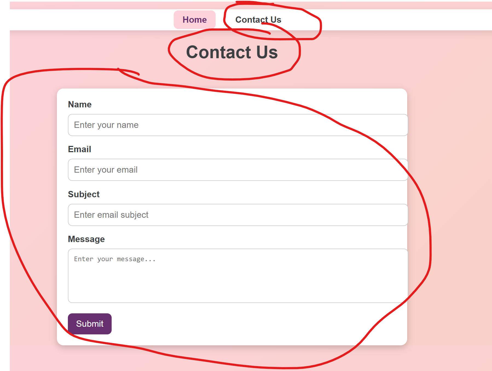

2. As a first-time user, I expect the game's rules to be straightforward and easy to understand, so I can 
   quickly grasp how to play and learn from the flashcards.

| **Feature**       | **Action**        | **Expected Result**                  | **Actual Result** |
| ----------------- | ----------------- | ------------------------------------ | ----------------- |
|  Game Rules |  Understand game rules and flow | Clear and straightforward rules, easy grasp of gameplay | Works as expected |

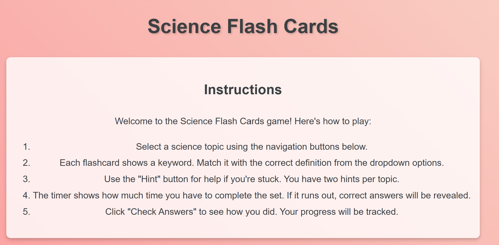

3. As a first-time user, I want the game to be accessible on various devices, such as computers, tablets 
   or phones, allowing me to conveniently learn anywhere.

| **Feature**       | **Action**        | **Expected Result**                  | **Actual Result** |
| ----------------- | ----------------- | ------------------------------------ | ----------------- |
|  Device Compatibility |  Access game on different devices | Able to use the game on computers, tablets, and phones | Works as expected |

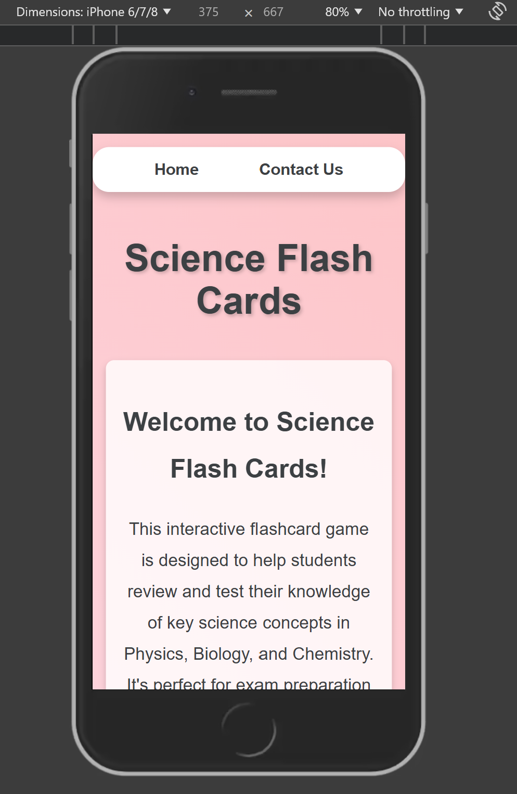

4. As a first-time user, I value having clear and concise information on each flashcard to help me learn 
   scientific terms accurately and efficiently and under time conditions with a timer.

| **Feature**       | **Action**        | **Expected Result**                  | **Actual Result** |
| ----------------- | ----------------- | ------------------------------------ | ----------------- |
|  Clear and Concise Content |  Read flashcard information and timer is visible | Accurate and concise information presented on each flashcard and timer is counting down | Works as expected |

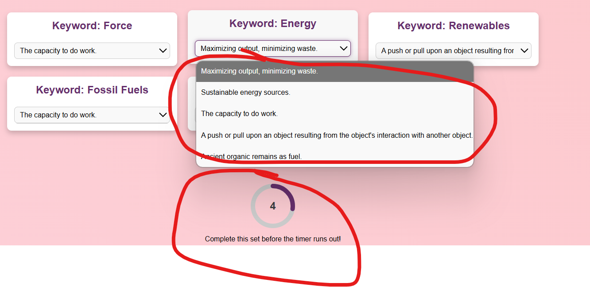

5. As a first-time user, I would appreciate having hints available when I need assistance with the 
   flashcards, making it easier for me to learn and understand the content.

| **Feature**       | **Action**        | **Expected Result**                  | **Actual Result** |
| ----------------- | ----------------- | ------------------------------------ | ----------------- |
|  Hints |  Request assistance with flashcards | Availability of limited hints, aiding learning | Works as expected |

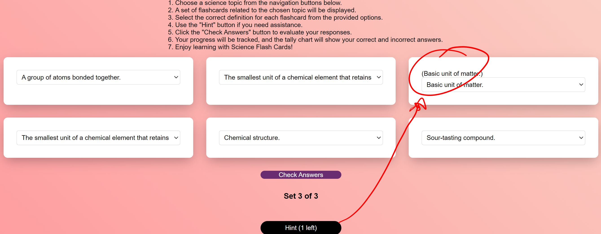

6. As a first-time user, I find it beneficial to be able to track my progress and view my performance  
   with the flashcards, giving me visibility into how well I am doing and motivating my learning experience.

| **Feature**       | **Action**        | **Expected Result**                  | **Actual Result** |
| ----------------- | ----------------- | ------------------------------------ | ----------------- |
|  Progress Tracking |  Track progress and view performance | Clear visibility of progress and performance metrics | Works as expected |

7. As a first-time user, I want an easy way to provide feedback to the game's creator, sharing my  
   thoughts or reporting any issues.

| **Feature**       | **Action**        | **Expected Result**                  | **Actual Result** |
| ----------------- | ----------------- | ------------------------------------ | ----------------- |
|  contact form |  Provide feedback to the game's creator | Easy and accessible feedback submission process | Works as expected |

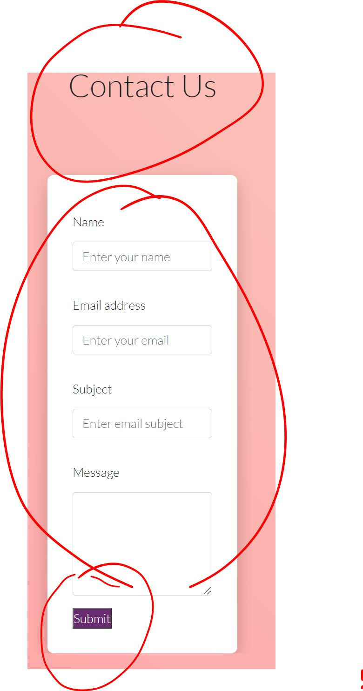

8. As a first-time user, I expect the Science Flash Card game to run smoothly and have all the features 
   working properly for a seamless learning experience.

| **Feature**       | **Action**        | **Expected Result**                  | **Actual Result** |
| ----------------- | ----------------- | ------------------------------------ | ----------------- |
|  Smooth Experience |  Use the Science Flash Card game | Game runs smoothly without glitches or feature malfunctions | Works as expected |

9. As a first-time user, I want confirmation that my message was sent.

| **Feature**       | **Action**        | **Expected Result**                  | **Actual Result** |
| ----------------- | ----------------- | ------------------------------------ | ----------------- |
|  Message Confirmation |  Submit a message through the contact form | Receive a confirmation message indicating successful submission | Works as expected |

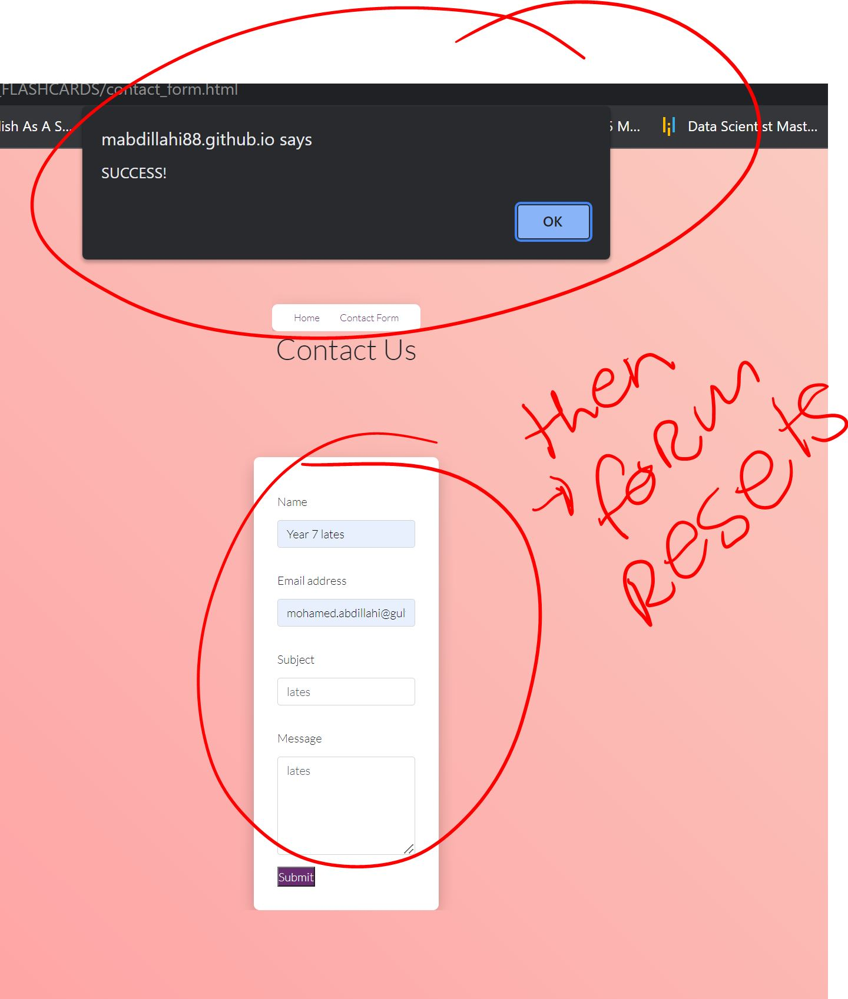

10. As a site Owner , I want the Science Flash Card game to be easy to understand and play.

| **Feature**       | **Action**        | **Expected Result**                  | **Actual Result** |
| ----------------- | ----------------- | ------------------------------------ | ----------------- |
|  Easy-to-Understand Game |  Explore and play the Science Flash Card game | Clear and straightforward instructions | Works as expected |

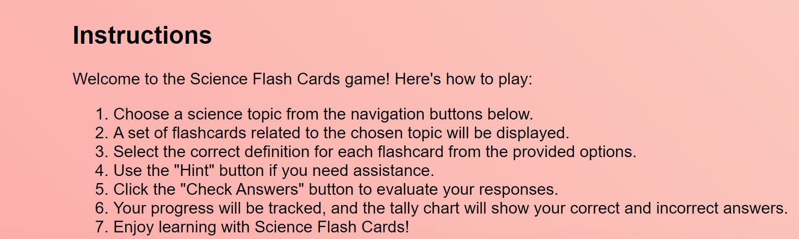

11. As a site Owner, I expect the game to work well on any device I use.

| **Feature**       | **Action**        | **Expected Result**                  | **Actual Result** |
| ----------------- | ----------------- | ------------------------------------ | ----------------- |
|  Device Compatibility |  Access game on different devices | Able to use the game on computers, tablets, and phones | Works as expected |

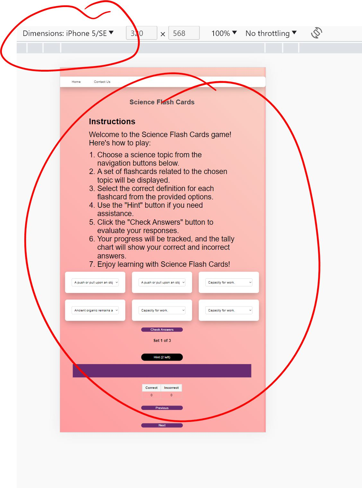

12. As a site Owner, if I enter an invalid URL, I want to see a helpful 404 error page instead of being confused.

| **Feature**       | **Action**        | **Expected Result**                  | **Actual Result** |
| ----------------- | ----------------- | ------------------------------------ | ----------------- |
|  User-Friendly 404 Error Page |  Access an invalid URL | Display a helpful 404 error page instead of confusion | Works as expected |

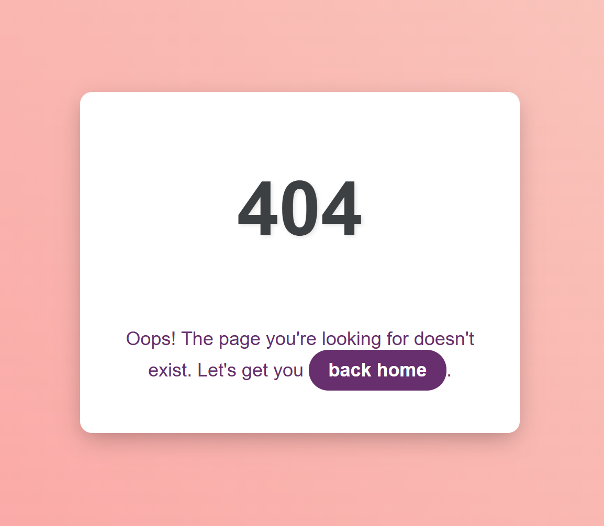

13. As a site Owner, I want to have a straightforward way to contact the site owner and share my comments or feedback.

| **Feature**       | **Action**        | **Expected Result**                  | **Actual Result** |
| ----------------- | ----------------- | ------------------------------------ | ----------------- |
|  contact form |  Provide feedback to the game's creator | Easy and accessible feedback submission process | Works as expected |

## Bugs

| **Bug** | **Fix** |
| ----------- | ----------- |
When devices were switched, the games were not responsive. | To account for the varied widths of devices, media query was utilized

## Deployment

The website was deployed using GitHub Pages by undertaken these stages:
1. In the GitHub repository navigate to the Settings tab
2. On the left hand menu select Pages
3. For the source select Branch: master
4. After the webpage refreshes automaticaly you will se a ribbon on the top saying: "Your site is published at https://mabdillahi88.github.io/CI_PP2_SCIENCE_FLASHCARDS/

### Forking the GitHub Repository
1. Go to the GitHub repository
2. Press on Fork button in top right corner

### Making a Local Clone
1. Go to the GitHub repository 
2. Find the Code button above the list of files and press it
3. Highlight the "HTTPS" button to clone with HTTPS and copy the link
4. Open Git Bash
5. Change the current working directory to the one where you want the cloned directory
6. Type git clone and paste the URL from the clipboard ($ git clone https://github.com/YOUR-USERNAME/YOUR-REPOSITORY)
7. Press Enter to create your local clone

## Credits

### Code

 - Responsive  nav was build on the inspiration using description on https://github.com/bedimcode/ 
    esponsive-navbar and https://www.w3schools.com/howto/howto_js_topnav_responsive.asp
 - Build on the inspiration from https://github.com/niilz/flashcards and https://www.youtube.com/watch? 
    v=urf3kHQX7aI&t=2874s
 - Email js tutorial help was employed to develop a contact form that sent an email to the specified 
   email address.
 - 404 page was build using descriptions on https://godnondsilva.github.io/
 - contact form was build using descriptions on https://www.w3schools.com/howto/howto_css_contact_form. 
   asp

## Acknowledgements

I would like to thank:
- My wife Filsan and my kids for all their patience, love and motivation to work on the project. 
- My mentor Mo Shami for his feedback, advice and support.
